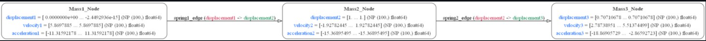

# Multi-Mass System Simulation

This Streamlit app simulates the behavior of a multi-mass system composed of interconnected masses and springs. It allows users to explore how the system's dynamics evolve over time.

## Purpose

The primary purpose of this app is to provide an interactive environment for users to visualize and analyze the behavior of a multi-mass system under different conditions. By adjusting parameters such as mass and spring constants, users can observe changes in the system's displacements, velocities, accelerations, and energy over time.

## Components

- **Simulation Execution:** Users can initiate the simulation by clicking the "Run Simulation" button. This triggers the calculation and visualization of various system properties.
- **Model Definition:** The multi-mass system is defined using the Model Description Format (MDF), allowing for flexible and modular representation of the system components.
- **Graph Visualization:** The app generates a visual representation of the multi-mass system graph, illustrating the connections between masses and springs.
- **Dynamic Plots:** Plots of displacement, velocity, acceleration, kinetic energy, potential energy, and total energy are provided to help users understand how these parameters evolve over time.

## Usage

1. **Run Simulation:** Click the "Run Simulation" button to initiate the simulation.
2. **Visualization:** Explore the generated graph image to understand the system's structure.
3. **Analysis:** Examine the dynamic plots to observe the evolution of key system properties over time.

## Screenshots

1. **Graph image of the multi-mass system:**
   

2. **Displacement over time for multiple masses:**
   

3. **Velocity over time for multiple masses:**
   

4. **Acceleration over time for multiple masses:**
   

   

## Conclusion

This Streamlit app serves as a valuable tool for studying the behavior of multi-mass systems in engineering and physics contexts. It offers an intuitive interface for experimenting with system parameters and visualizing the resulting dynamics, facilitating deeper insights into complex physical systems.
